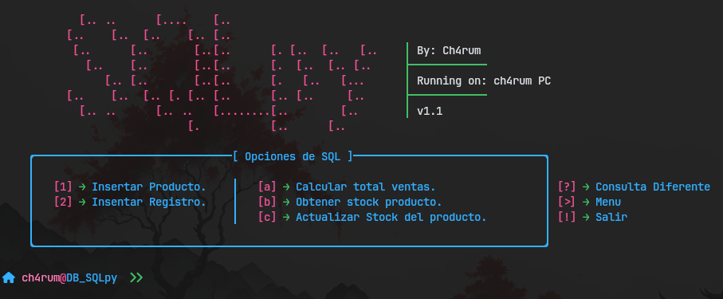

---

## Update & organizing the code for a new database

##### November 25, 2024

|  |
| :--------------------------------------------------------------------------------------------------------------------------------: |
|                                                               New Database                                                    |

### Update Description:
1. **New Menu**
   - A new menu, called `MenuTwo` has been incorporated into the system, offering expanded options for interacting with the database.
   - Support has been added for the new `MenuTwo` databases, where several defined operations can be performed.

2. **Code Restructuring**
   - The `Menu` class has been created to extend the necessary classes to work according to the chosen database.
   - The database connection has been improved by using the `ConnectDB` class to handle authentication and database credentials more efficientry. 
   - The code now robustly handles exceptions and errors when connecting to the database, ensuring a smooth user experience.

> [!WARNING]
> The database used is already created in advance. You can [download to here](https://github.com/ch4rum/ProgrammingExer/tree/master/DB/DBLab2).
