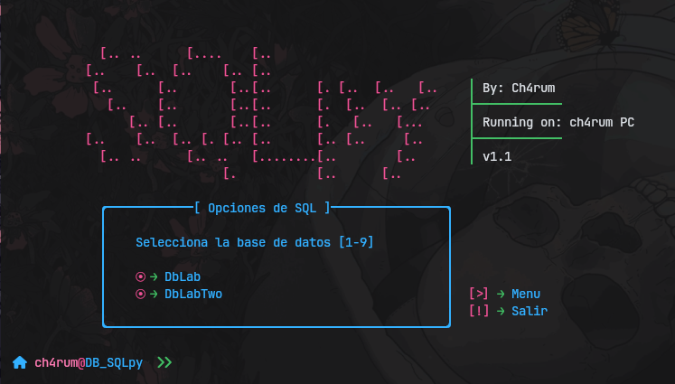

# SQLpy
<div align = center>


&ensp;[<kbd> <br> Usage <br> </kbd>](#-usage)&ensp;
&ensp;[<kbd> <br> Features <br> </kbd>](#-feature)&ensp;
&ensp;[<kbd> <br> Changelog <br> </kbd>](https://github.com/ch4rum/ProgrammingExer/blob/master/Python/DBappT/CHANGELOG.md)&ensp;
<br></div>

## 👾 Feature
**Visual Experience**

$Python$ code provides a command line interface **$(CLI)$** for managing and querying data in a *SQL* database. It allows you to perform **CRUD** operations, execute custom queries and handle close signals securely, providing a simple and efficient user experience.

- Prompting the user for their DB username and password. The password is *base64* encrypted, using a random encryption key, to ensure the security of the access data.

- Present the user with an interactive menu with various options for managing the database. Each option is labeled with a number or letter, allowing easy navigation.

- Allow inserting new records into the database. Each function requests the necessary data and sends it to the database for storage.

- Methods that allow the user to perform queries and generate reports based on the data in the database. In addition, the option to run custom queries though the *different_query* method is included. 

> [!CAUTION]
> The database used is already created in advance. You can [download to here](https://github.com/ch4rum/ProgrammingExer/tree/master/DB/).

Check the [changelog](https://github.com/ch4rum/ProgrammingExer/blob/master/Python/DBappT/CHANGELOG.md) for updates.

## 💻 Usage

<b>Open a terminal</b>
-  First download the code
```sh
# Option 1
git clone --no-checkout https://github.com/ch4rum/ProgrammingExer.git
cd ProgrammingExer
git sparse-checkout init --cone
git sparse-checkout set Python/DBappT
git checkout main

# Option 2
svn export https://github.com/ch4rum/ProgrammingExer/trunk/Python/DBappT
```
If you prefer, you can use an online tool like [**DownGit**](https://downgit.github.io) that allows you to download specific folders from *GitHub* without the need to clone the entire repository.

- Second, install the following dependencie
```sh
# In windows & some linux 
pip install mysql-connector-python prettytable pycryptodome colorama termcolor 

# In Arch and some derivate
sudo pacman -S --noconfirm python-mysql-connector python-colorama python-prettytable python-pycryptodome python-termcolor 
```

- Now give it execute
```sh
python3 main.py
```