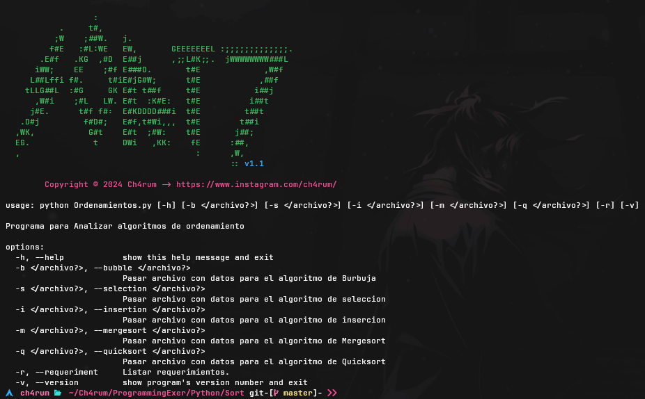

# Sorting - Analysis of Sorting Algorithms

<div align = center>


&ensp;[<kbd> <br> Description <br> </kbd>](#-Description)&ensp;
&ensp;[<kbd> <br> Usage <br> </kbd>](#-usage)&ensp;
<br></div>

This is a Python script designed to analyze and compare different sorting algorithms, such as Bubble, Selection, Insertion, Mergesort and Quicksort algorithms. The script allows sorting data from files provided as input, and displays statistics on the execution time of the algorithm used.

## ✨ Description

The program provides a command line interface to execute different sorting algorithms depending on the parameters passed to the script. It allows to load a file with data and perform the sorting using any of the mentioned algorithms. In addition, it offers the option to display the requirements needed to run the script and the current version of the program.

The algorithms implemented are:
- **Bubble Sort:** Compares and sorts adjacent items in the list.
- **Selection Sort:** Finds the smallest element and places it in the correct position.
- **Insertion Sort:** Inserts the unsorted items in the correct position.
- **Merge Sort:** Divide and conquer to sort.
- **Quick Sort:** Uses the pivot to split the list and sort the subsets.

Each algorithm is tested with different data sets and the execution time is recorded for each.

## 🎸 Usage

To run this script, you need to install some dependencies in your Python environment. To do this, you can use `pip` or `pacman`:

-  First download the code
```sh
# Option 1
git clone --no-checkout https://github.com/ch4rum/ProgrammingExer.git
cd ProgrammingExer
git sparse-checkout init --cone
git sparse-checkout set Python/Sort
git checkout main

# Option 2
svn export https://github.com/ch4rum/ProgrammingExer/trunk/Python/Sort
```
If you prefer, you can use an online tool like [**DownGit**](https://downgit.github.io) that allows you to download specific folders from *GitHub* without the need to clone the entire repository.

- Second, install the following dependencie
```sh
# In windows & some linux 
pip install pwntools colorama

# In Arch & some derivate
sudo pacman -S --noconfirm python-colorama python-pwntools
```

- Now give it execute
```sh
python3 main.py
```