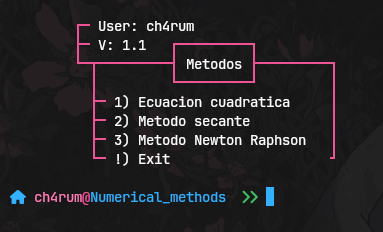

---

## Newton-Raphson Method Update & Impression Enhancement

##### November 20, 2024

|  |
| :--------------------------------------------------------------------------------------------------------------------------------: |
|                                                               New Method                                                    |

### Update Description:
1. **Implementation of the Newton-Raphson Method:**
   - The `tecnic_newton_raphson` method has been added, which applies the Newton-Raphson algorithm to find the root of an equation by iterations.
   - This method takes as parameters an initial approximation value (a tuple) and the maximum number of iterations.
   - The algorithm iteratively computes the value of the root of the function using the derivatives, until the relative error is less than a specified threshold.
   - The method returns a list of dictionaries with the results of each iteration.
   - The method terminates if the error is less than the specified threshold or if the maximum number of iterations is reached.

2. **Improved Results Printing:**
   - The `tecnic_newton_raphson` function has been added to print the results in a clearer and more understandable way, using a formatted table.
   - The results are presented in a results table using the PrettyTable library, which organizes the data in a structured way.
   - The code now displays the values for each iteration with higher precision (rounded to 6 decimal places).
   - If any errors occur during the process, a detailed error message is displayed to improve debugging.

> [!WARNING]
> The functions are evaluated in formulas already defined in the code, change the part of the code if needed.
>
> ```python3
>    def fn(self: 'AlgoritmEc', t: float) -> float:
>        return 3 * math.exp(0.68*t) - 1100*t 
>
>    def f_prime(self: 'AlgoritmEc', t: float) -> float:
>        return 2.04 * math.exp(0.68*t) - 1100
>```

### Install new dependency:
Make sure you have the *PrettyTable* library installed for the table formatting to work properly. You can install it by running 
```shell
# In windows & some linux
pip install prettytable

# In Arch & some derivate
sudo pacman -S --noconfirm python-prettytable
```