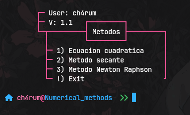

# Numerical algorithms
<div align = center>


&ensp;[<kbd> <br> Usage <br> </kbd>](#-usage)&ensp;
&ensp;[<kbd> <br> Features <br> </kbd>](#-feature)&ensp;
<br></div>

## 👾 Feature
**Visual Experience**

This $Python$ code provides a comprehensive visual experience for understanding how different numerical methods approximate the root of a quadratic function. By implementing the methods, the code allows users to observe how each technique adjusts its estimate at each iteration, illustrating intermediate calculations and convergence to the final solution. This helps to compare the methods and better understand the refinement process at each step, providing clear context on the behavior of each approach and allowing users to visualize progress toward the desired solution.

> [!CAUTION]
> The function is evaluated at $ax²+bx-c$ by secant method, change if necessary.

## 💻 Usage

<b>Open a terminal</b>
-  First download the code
```sh
# Option 1
git clone --no-checkout https://github.com/ch4rum/ProgrammingExer.git
cd ProgrammingExer
git sparse-checkout init --cone
git sparse-checkout set Python/algNumeric
git checkout main

# Option 2
svn export https://github.com/ch4rum/ProgrammingExer/trunk/Python/algNumeric
```
If you prefer, you can use an online tool like [**DownGit**](https://downgit.github.io) that allows you to download specific folders from *GitHub* without the need to clone the entire repository.

- Second, install the following dependencie
```sh
# In windows & some linux 
pip install colorama

# In Arch and some derivate
sudo pacman -S --noconfirm python-colorama
```

- Now give it execute
```sh
python3 main.py
```